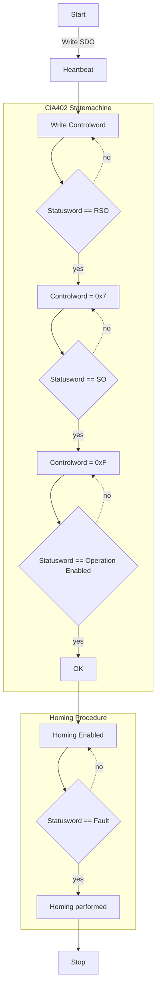

```mermaid
flowchart TD
Start --> |Write SDO| Heartbeat

Heartbeat --> SO

OK --> HE
HD --> Stop
subgraph Statemachine [CiA402 Statemachine]
    SO[Write Controlword] --> C{Statusword == RSO}
    C --> |yes| C1[Controlword = 0x7]
    C -.-> |no| SO

    C1 --> C2{Statusword == SO}
    C2 --> |yes| C3[Controlword = 0xF]
    C2 -.-> |no| C1

    C3 --> C4{Statusword == Operation Enabled}
    C4 --> |yes| OK
    C4 -.-> |no| C3
end

subgraph Homing [Homing Procedure]
    HE[Homing Enabled] --> Fault{Statusword == Fault}
    Fault --> |yes| HD[Homing performed]
    Fault -.-> |no| HE
end

```